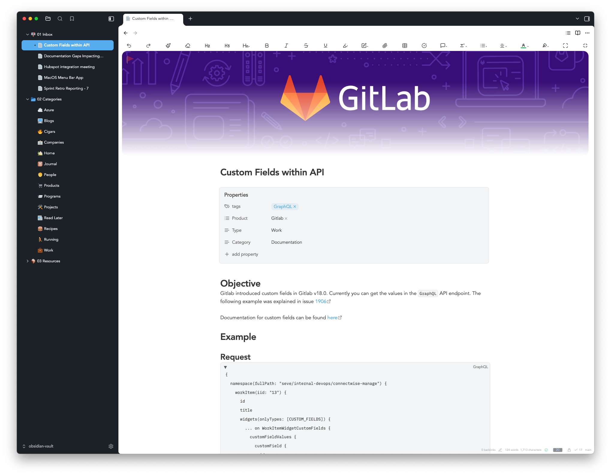

# Obsidian Baseline Theme Customization

This repository contains my customizations for the Obsidian Baseline theme. Follow the setup instructions below to configure your Obsidian vault with these customizations.

> You can now just select "Admin" them in style settings, and High Contrast (style settings > light mode background contrast) after setting Baseline as your theme. I will leave my CSS snippet here as there are some additional customizations that I have, and will continue to make.

## Setup Instructions

### 1. Install Baseline Theme
- Open Obsidian Settings
- Go to Appearance → Themes
- Search for and install "Baseline" theme
- Enable the Baseline theme and set it as your active theme
- Make sure the theme is set to **Light** mode
- Set the Accent Color in Appearance settings to RGB(85, 172, 238) 

### 2. Configure Fonts
- In Appearance settings, set:
  - **Interface font**: Avenir
  - **Text font**: Avenir  
  - **Monospace font**: IBM Plex Mono

### 3. Disable Native Menus
- In Appearance settings, turn **OFF** "Native menus"

### 4. Install Style Settings Plugin
- Go to Community Plugins
- Search for and install "Style Settings"
- Enable the plugin
- Import the settings from `style settings/style-settings.json`

### 5. Add CSS Snippet
- Copy the file from `css snippets/baseline-lighttheme-darksidebar-customization.css` to your vault's `.obsidian/snippets/` folder
- Go to Appearance → CSS snippets
- Enable the "baseline-lighttheme-darksidebar-customization" snippet

### 6. Optional Recommended Plugins

#### Collapsible Code Blocks
- Adds collapsible functionality to code blocks
- Search for "Collapsible code blocks" in Community Plugins

#### Iconize
- Adds custom icons for folders and files
- Search for "Iconize" in Community Plugins

#### Pixel Banner
- Adds header images to notes
- Search for "Pixel Banner" in Community Plugins

#### Dynamic Editor Width
- Allows for a more flexible editor width
- Search for "Dynamic Editor Width" in Community Plugins
